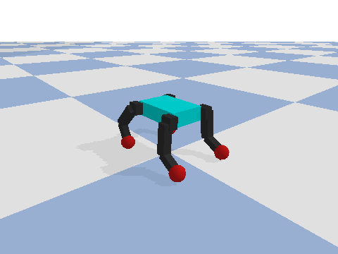
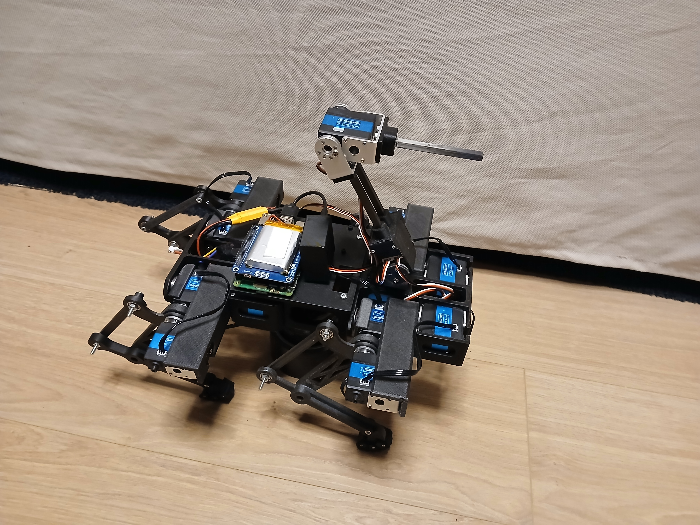

## Burt the quadruped robot

This is my quadruped robot code based off:

https://github.com/stanfordroboticsclub/StanfordQuadruped

### Simulation

Burt trotting in the PyBullet simulator (`run_sim.py`):

  

Regenerate this clip with `python make_walk_gif.py`.

### The real thing

  

